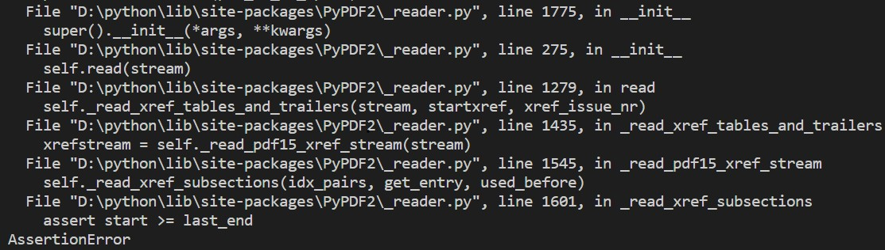

# PDF_tools
<h>搜集/编写的PDF小工具，部分有GUI。</h>
<h1 id="tool1">TOOL1：分割PDF——PDF_split_GUI.py</h1>
<h2 id="mentory1">CSDN上看到的一个PDF分割的GUI脚本，使用简单，在此留存和分享。</h2>

  
代码来源：<a href="https://blog.csdn.net/u013185349/article/details/126383855" text-decoration="none">Python脚本分割PDF文件</a>（有略微的非实质性的修改）

  
需要安装的库：PyPDF2 [pip install pypdf2]

  
SOME TIPS:

  
    
TIP1--

    
    
出现这个问题是文件页码超出范围但由于各种原因可以点击执行分割命令，但是无法完成分割操作并报错AssertionError，根据报错信息，只要找到错误来源文件，将assert start>=last_end这一条注释掉即可，为了防止出现其他问题，完成分割后应当恢复这一条命令。

    
TIP2--

    
我后来看了一下PyPDF2这个库有更新了，一些方法的名称有了变化，所以进行了一点点修改。

  

  
<h1 id="tool2">TOOL2：图片合并成PDF——pictures_to_PDF_GUI.py</h1>
<h2 id="mentory2">按需求将图片[集合]转为PDF（例如将一堆扫描件或照片放在一块儿），更方便浏览、保存和传输。</h2>

  
代码来源：自主编写。

  
需要安装的库：Pillow [pip install pillow]

  
SOME TIPS:

  
    
TIP1--

    
没有设计选取合并一个文件夹中所有图片的功能，主要考虑到合成图片数量不多时没有这个需求，热心的小伙伴可以补充后@我，非常感谢。

    
TIP2--

    
一般合成是要考虑到图片顺序的，这里使用的是默认顺序，合成的时候最好将图片名称改为按顺序的如1.jpg、2.jpg等，不然可能无法达到理想效果。

    
TIP3--

    
支持.jpg/.jpeg/.png/.bmp/.ppm/.gif/.tiff格式的图片，其他格式可以在select()函数的lst变量中补充。

    
TIP4--

    
注意输出的文件夹下面不要有名为combine_result.pdf的文件（虽然这个文件名很不常见），否则该文件会被覆盖导致丢失。

  

  
<h1 id="tool3">TOOL3：PDF合并——PDF_combine_GUI.py</h1>
<h2 id="mentory3">按需求将多个PDF按一定顺序合并，更方便浏览、整理和打印。</h2>

  
代码来源：自主编写，参考了<a href="https://blog.csdn.net/manchan4869/article/details/123024537" text-decoration="none">Python合并PDF</a>。

  
需要安装的库：pypdf2 [pip install pypdf2]

  
SOME TIPS:

  
    
TIP1--

    
没有设计选取合并一个文件夹中所有pdf文件的功能，主要考虑到合成文件数量不多时没有这个需求，热心的小伙伴可以补充后@我，非常感谢。

    
TIP2--

    
一般合成是要考虑到文件顺序的，这里使用的是默认顺序，合成的时候最好将图片名称改为按顺序的如1.pdf、2.pdf等，不然可能无法达到理想效果。

    
TIP3--

    
注意输出的文件夹下面不要有名为combine_result.pdf的文件（虽然这个文件名很不常见），否则该文件会被覆盖导致丢失。

  

